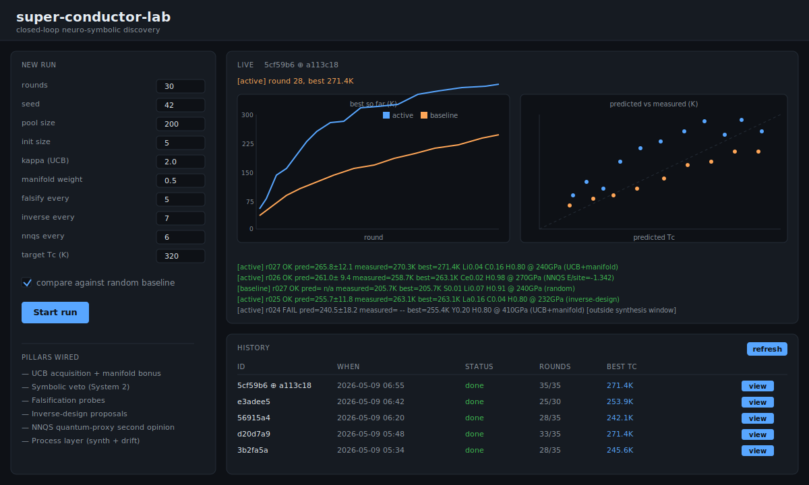

# super-conductor-lab

[](https://codespaces.new/anduaura/super-conductor-lab)

A runnable, numpy-only prototype of a closed-loop neuro-symbolic discovery
engine for room-temperature superconductor candidates. The whole architecture
fits in one Python package; nothing is mocked at the API surface — only the
underlying physics is.



## Live demo

Click the Codespaces badge above. The container will:

1. Install the package with the `[web,dev]` extras.
2. Run the test suite to verify the build (~10s).
3. Start `scl serve` on port 8765 in the background.
4. Auto-open the forwarded URL in your browser.

You can then start a run from the form, watch it stream round-by-round, and
optionally launch a paired random-search baseline for comparison.

### Keeping it free

Codespaces costs nothing for typical demo use, but the only **hard** guarantee
is a spending limit. Three steps:

1. **Set a $0 spending limit (one-time, hard cap).** GitHub → Settings →
   Billing & plans → [Codespaces spending limit](https://github.com/settings/billing/spending_limit)
   → set to **$0**. With this in place, GitHub will refuse to bill you no
   matter what — usage simply stops once the free tier is exhausted.
2. **The 2-core default is enough.** Personal accounts get 120 core-hours and
   15 GB-month of storage free, which is ~60 hours on a 2-core machine. A
   full demo run is minutes, not hours.
3. **Stop the codespace when done.** Top-right menu → *Stop codespace*. The
   default 30-minute idle timeout does this automatically, but stopping
   manually keeps the meter at zero.

The "Codespace usage for this repository is paid for by anduaura" notice on
the launch page just routes any billing to the repo owner's account — the
$0 limit on that account means nothing can actually be charged.

## Architecture

| Manifesto component                | Module               | Stand-in                                |
| ---------------------------------- | -------------------- | --------------------------------------- |
| System 1 — neural intuition        | `scl/neural.py`      | Gaussian-process surrogate (mean + var) |
| System 2 — symbolic veto           | `scl/symbolic.py`    | Hard + soft rule engine                 |
| Hidden ground truth (DFT proxy)    | `scl/world_model.py` | Hand-crafted Tc landscape               |
| NNQS — quantum proxy               | `scl/nnqs.py`        | Carleo–Troyer RBM over a small TFIM     |
| Information-manifold engine        | `scl/manifold.py`    | Numerical Hessian curvature bonus       |
| Differentiable physics             | `scl/diffphys.py`    | Inverse design via gradient descent     |
| Process layer (synth + drift)      | `scl/process.py`     | Synthesis-window + phase nucleation     |
| Mock self-driving lab              | `scl/lab.py`         | Process-aware noisy measurement         |
| UCB acquisition                    | `scl/active.py`      | Exploit-explore selection               |
| Falsification probes               | `scl/falsify.py`     | Adversarial neighbors of current best   |
| Closed-loop driver                 | `scl/loop.py`        | Orchestrator with pluggable cadences    |
| Web UI (FastAPI + SSE)             | `scl/web/`           | REST + SSE + JSONL persistence          |
| CLI                                | `scl/cli.py`         | `scl run` and `scl serve`               |

The world model is **hidden from the surrogate** — the lab is the only data
channel. See `CLAUDE.md` for the full set of architectural invariants.

## How each piece helps find a superconductor (ELI5)

Imagine the AI is a kid trying to invent a new kind of magic-cold-rock. There
are *trillions* of possible recipes and the kid only gets to actually bake a
few. Every component is one trick that makes those few bakes count.

| Piece | What it does (ELI5) | Why it gets us closer to a superconductor |
| --- | --- | --- |
| **Candidates** (`scl/candidates.py`) | A box of LEGO blocks (atoms) you can snap together into rocks. | Defines the space of recipes the AI is even allowed to think about. |
| **Symbolic veto** (`scl/symbolic.py`) | A strict grandparent who shouts "NO" if you try to put soap in your sandwich. | Throws out recipes that break physics *before* you waste an oven slot on them. |
| **Neural surrogate** (`scl/neural.py`) | A kid who has tasted 5 candies and now guesses which untried ones will be yummy — and how *sure* they are. | Lets the AI rank trillions of unmade rocks by predicted Tc, with honest "I don't know" zones. |
| **World model** (`scl/world_model.py`) | The teacher's secret answer key. The kid never sees it; only the oven does. | Pretends to be reality. Forces the AI to learn through experiments instead of cheating. |
| **Self-driving lab** (`scl/lab.py`) | A robot oven that bakes the recipe and tells you how cold the rock got. Sometimes it sneezes and the number is a little wrong. | The only honest signal the AI gets. Every other module is just guessing about what this will say. |
| **Process layer** (`scl/process.py`) | The oven sometimes burns the cookie or makes brownies instead. You have to pick recipes that *survive* the oven. | Forces the AI to learn "makeable" alongside "good" — the same gap that breaks real-world materials science. |
| **UCB picker** (`scl/active.py`) | When choosing the next candy, sometimes pick the one you think is yummiest, sometimes pick the weirdest unknown one. | Balances exploit (test the leader) and explore (learn somewhere new). One pick at a time, used wisely. |
| **Manifold engine** (`scl/manifold.py`) | When walking blindfolded, notice which spots feel "peaky." Peaks are usually exciting places to dig. | Adds a curvature bonus that nudges the AI toward parts of the recipe space where small changes make a big difference. |
| **Falsification** (`scl/falsify.py`) | Try to *prove yourself wrong* on purpose. Pick the recipe you think will *fail* and bake it anyway. | If a "should fail" recipe doesn't fail, the AI's mental model has a hole — and it just learned the most informative thing possible. |
| **Inverse design** (`scl/diffphys.py`) | Instead of guessing recipes and tasting, say "I want a 300K cake" and let math walk *backwards* to a recipe. | Stops random guessing once the AI has a goal. Targets a Tc and asks the surrogate "what composition would give me this?" |
| **NNQS proxy** (`scl/nnqs.py`) | A tiny pretend lab inside the AI's head that imagines atoms wiggling in quantum-land. | A "second opinion" that catches surrogate hallucinations before the real (slow, expensive) lab gets called. |
| **Closed-loop driver** (`scl/loop.py`) | The kitchen manager who decides when each helper does what. | Wires everything together: pool → veto → score → pick → bake → learn → repeat. The "discovery" part of "discovery engine." |
| **Web UI** (`scl/web/`) | A big TV showing the kitchen so a grown-up can watch and start new bakes. | Makes the loop visible and re-runnable; persists every bake so you can compare yesterday's run to today's. |

The trick that makes the whole thing work: the **honest oven** (lab) is the
only thing that touches the **secret answer key** (world model). Every other
piece — guesses, vetos, quantum daydreams, peak-feelers, target-walkers — is
the AI's *self-built understanding* of what the oven will say. The closed loop
is what makes that understanding sharper every round.

## Install

```bash
# core only — CLI + tests
pip install -e '.[dev]'

# with the web UI
pip install -e '.[web,dev]'
```

## Run

```bash
# headless: 30 rounds of active learning, optionally paired with random search
scl run --rounds 30 --seed 42 --baseline

# full UI on http://127.0.0.1:8765
scl serve --port 8765
```

CLI flags map 1:1 to loop knobs: `--kappa`, `--manifold-weight`,
`--falsify-every`, `--inverse-every`, `--nnqs-every`, `--target-tc`.

## Test

```bash
pytest -q
# 31 passing across symbolic, neural, NNQS, manifold, diffphys, process,
# loop, and web layers.
```

## Repository layout

```
scl/
├── candidates.py        # composition space + featurization
├── symbolic.py          # rule engine (System 2)
├── neural.py            # GP surrogate (System 1)
├── world_model.py       # hidden ground truth (DFT proxy)
├── nnqs.py              # RBM wavefunction (TFIM) + quantum_proxy
├── manifold.py          # curvature-of-belief acquisition bonus
├── diffphys.py          # inverse design
├── process.py           # synthesis window + phase drift
├── lab.py               # mock self-driving lab
├── active.py            # UCB / random selection
├── falsify.py           # adversarial probes
├── loop.py              # closed-loop orchestrator
├── cli.py               # `scl run` + `scl serve`
└── web/                 # FastAPI app + SSE + vanilla-JS frontend
tests/                   # 31 pytests
docs/ui.svg              # UI mock used in this README
CLAUDE.md                # operating rules + milestones
```
